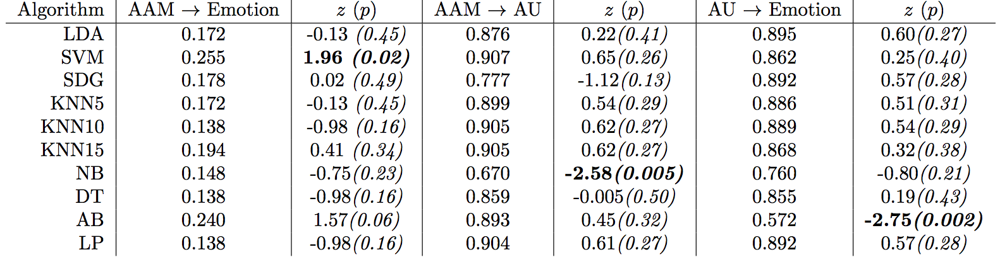
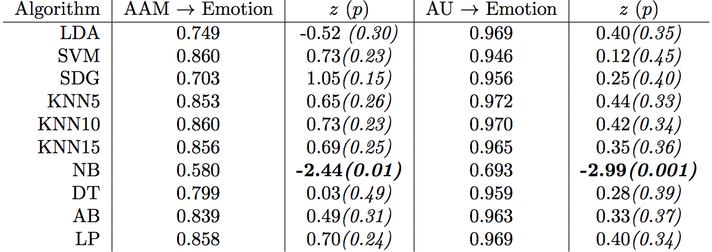

# Comparing Supervised Machine Learning Algorithms for Emotion Recognition Performance

## Description 
I compared 8 machine learning algorithms for human emotion recognition using Scikit-learn's python library. 
I used the Extended Cohn-Kanade Dataset (CK+), which is a database developed by Carnegie Mellon Univer- sity and the University of Pittsburgh, and it contains facial expression data that can be used to study automatic facial expression detection.
Specifically, I used the Active Appearance Models Landmarks (AAMs), Facial Action Coding System (FACS) Action Unit (AU) Labels, and the emotion labels for the video sequence. 
### Algorithms
<ul>
	<li>Linear Discriminant Analysis (LDA)</li>
	<li> Support Vector Machine (SVM) </li>
	<li> Stochastic Gradient Descent (SGD) </li>
	<li> K-Nearest Neighbors k = 5 (KNN5) </li>
	<li> K-Nearest Neighbors k = 10 (KNN10) </li>
	<li> K-Nearest Neighbors k = 15 (KNN15) </li>
	<li> Naive Bayes (NB) </li>
	<li> Decision Tree (DT) </li>
	<li> AdaBoost (AB) </li>
	<li> Label propagation (LP)</li>
</ul>

### Features and Classification
<ul>
	<li> AAM as feature, emotion label as classification</li>
	<li> AU as feature, emotion label as classfication </li>
	<li> AAM as feature, AU as classification</li>
</ul>

### Results

